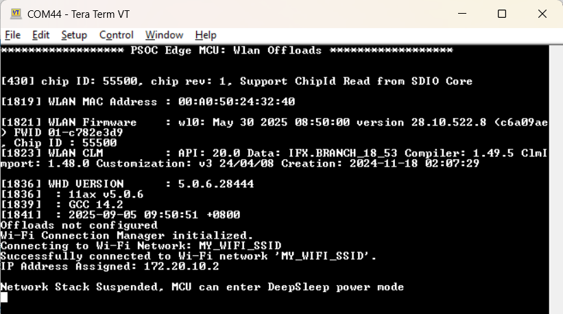
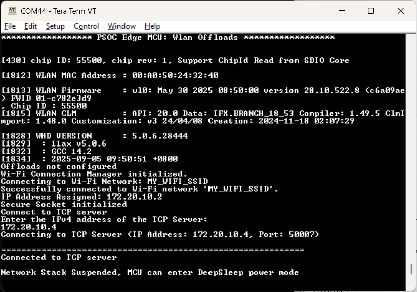
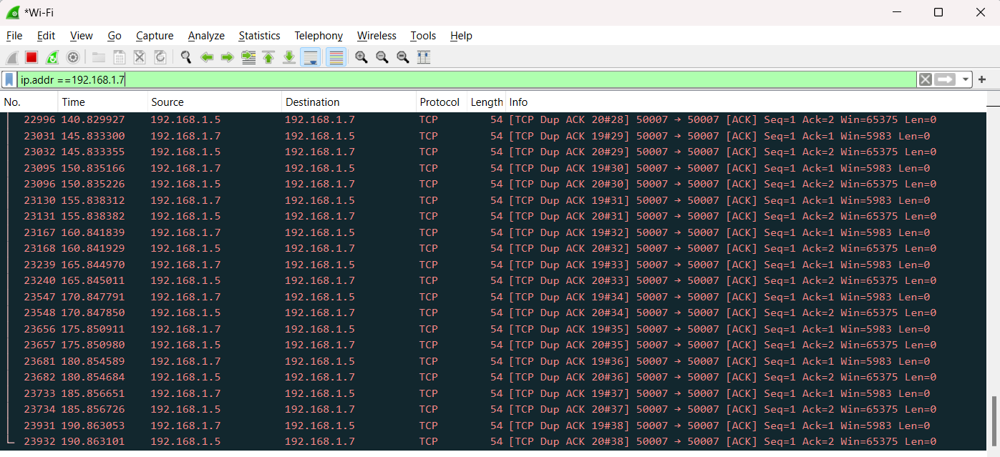
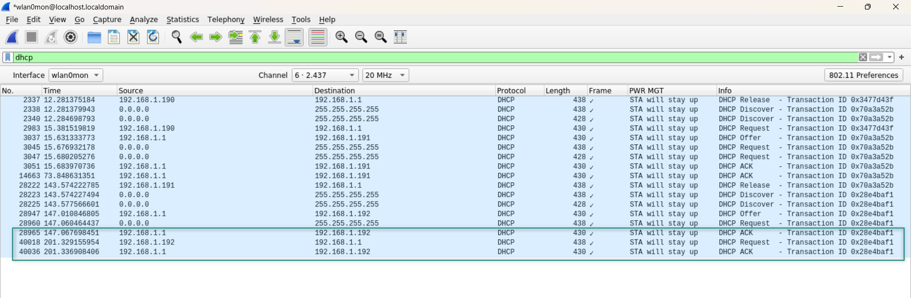
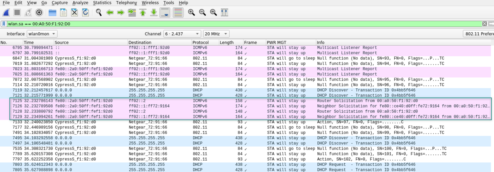
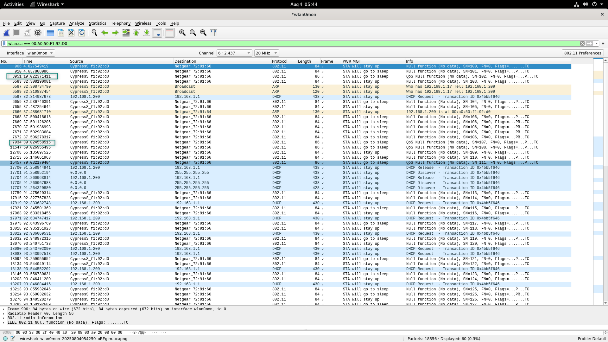
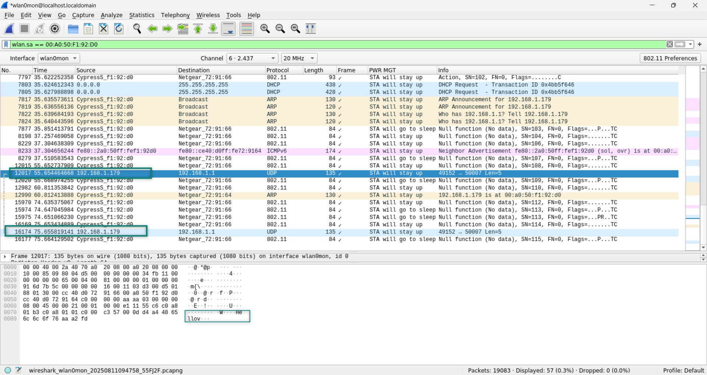
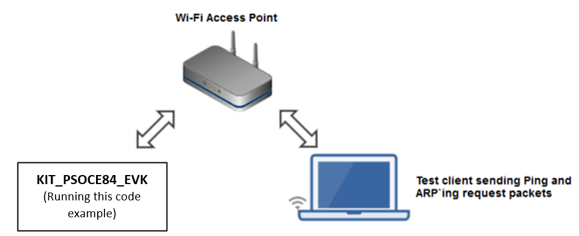
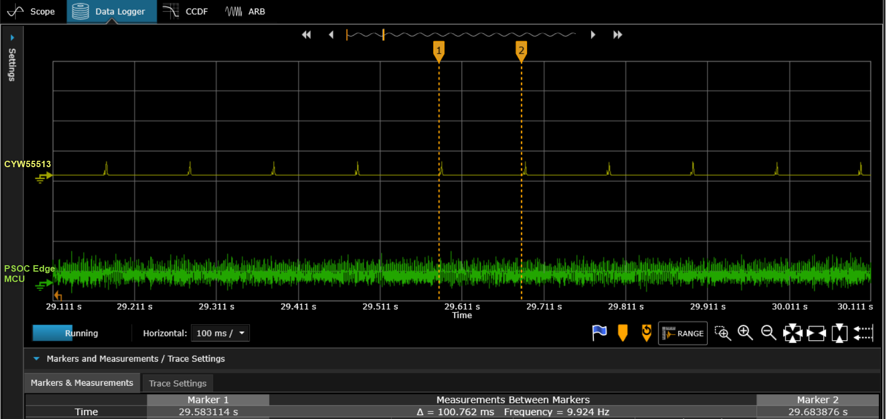

# PSOC&trade; Edge MCU: WLAN offloads

This code example demonstrates various WLAN offloads offered by Infineon's AIROC&trade; Wi-Fi devices using the PSOC&trade; Edge MCU. It employs the Low Power Assistant (LPA) middleware library, which helps develop low-power applications for Infineon devices.

The WLAN offload functionalities offload to the WLAN device, allowing the host MCU to enter Sleep and Deep Sleep states. Therefore, reducing the overall system power consumption.

This code example has a three project structure: CM33 secure, CM33 non-secure, and CM55 projects. All three projects are programmed to the external QSPI flash and executed in Execute in Place (XIP) mode. Extended boot launches the CM33 secure project from a fixed location in the external flash, which then configures the protection settings and launches the CM33 non-secure application. Additionally, CM33 non-secure application enables CM55 CPU and launches the CM55 application.

[View this README on GitHub.](https://github.com/Infineon/mtb-example-psoc-edge-wlan-offloads)

[Provide feedback on this code example.](https://cypress.co1.qualtrics.com/jfe/form/SV_1NTns53sK2yiljn?Q_EED=eyJVbmlxdWUgRG9jIElkIjoiQ0UyNDAwNjIiLCJTcGVjIE51bWJlciI6IjAwMi00MDA2MiIsIkRvYyBUaXRsZSI6IlBTT0MmdHJhZGU7IEVkZ2UgTUNVOiBXTEFOIG9mZmxvYWRzIiwicmlkIjoicmFtYWtyaXNobmFwIiwiRG9jIHZlcnNpb24iOiIyLjAuMCIsIkRvYyBMYW5ndWFnZSI6IkVuZ2xpc2giLCJEb2MgRGl2aXNpb24iOiJNQ0QiLCJEb2MgQlUiOiJJQ1ciLCJEb2MgRmFtaWx5IjoiUFNPQyJ9)

See the [Design and implementation](docs/design_and_implementation.md) for the functional description of this code example.


## Requirements

- [ModusToolbox&trade;](https://www.infineon.com/modustoolbox) v3.6 or later (tested with v3.6)
- Board support package (BSP) minimum required version: 1.0.0
- Programming language: C
- Associated parts: All [PSOC&trade; Edge MCU](https://www.infineon.com/products/microcontroller/32-bit-psoc-arm-cortex/32-bit-psoc-edge-arm) parts


## Supported toolchains (make variable 'TOOLCHAIN')

- GNU Arm&reg; Embedded Compiler v14.2.1 (`GCC_ARM`) – Default value of `TOOLCHAIN`
- Arm&reg; Compiler v6.22 (`ARM`)
- IAR C/C++ Compiler v9.50.2 (`IAR`)
- LLVM Embedded Toolchain for Arm&reg; v19.1.5 (`LLVM_ARM`)


## Supported kits (make variable 'TARGET')

- [PSOC&trade; Edge E84 Evaluation Kit](https://www.infineon.com/KIT_PSE84_EVAL) (`KIT_PSE84_EVAL_EPC2`) – Default value of `TARGET`
- [PSOC&trade; Edge E84 Evaluation Kit](https://www.infineon.com/KIT_PSE84_EVAL) (`KIT_PSE84_EVAL_EPC4`)


## Hardware setup

This example uses the board's default configuration. See the kit user guide to ensure that the board is configured correctly.

Ensure the following jumper and pin configuration on board.
- BOOT SW must be in the HIGH/ON position
- J20 and J21 must be in the tristate/not connected (NC) position


## Software setup

See the [ModusToolbox&trade; tools package installation guide](https://www.infineon.com/ModusToolboxInstallguide) for information about installing and configuring the tools package.

Install a terminal emulator if you do not have one. Instructions in this document use [Tera Term](https://teratermproject.github.io/index-en.html).

This example requires no additional software or tools.


## Operation

See [Using the code example](docs/using_the_code_example.md) for instructions on creating a project, opening it in various supported IDEs, and performing tasks, such as building, programming, and debugging the application within the respective IDEs.

1. Connect the board to your PC using the provided USB cable through the KitProg3 USB connector

2. Open *tcp_client.h* and modify the `WIFI_SSID`, `WIFI_PASSWORD`, and `WIFI_SECURITY_TYPE` macros to match the Wi-Fi network credentials that you want to connect to. All possible security types are defined in the `cy_wcm_security_t` structure in the *cy_wcm.h* file
      > **Note:** Build the application if any changes have been made

3. Ensure that your PC is connected to the same Wi-Fi access point (AP) you configured in Step 2.

   All WLAN offload settings are already configured for this example in the Device Configurator except for the IP address of the server (your PC).

    > **Note:** Build the application if any changes have been made

4. Open a terminal program and select the KitProg3 COM port. Set the serial port parameters to 8N1 and 115200 baud

5. Open a command shell and run the Python TCP echo server (*tcp_server.py*) from the project directory. The Python script starts a TCP server and the server starts listening for incoming TCP connections

   ```
   python tcp_server.py
   ```

   > **Note:** Ensure that the firewall settings of your PC allow Python access to communicate with the TCP client. See this [community thread](https://community.infineon.com/thread/53662)

6. After programming, the application starts automatically. Confirm the following logs appear on the serial terminal

      **Figure 1. Terminal output on program startup**

      
  
   >**Note:** To facilitate testing of the offloads, it is required to enable them through the device configurator, following the instructions provided in the [Design and implementation](docs/design_and_implementation.md)

7. Open *proj_cm33_ns/tcp_client.h* and set `TCP_KEEPALIVE_OFFLOAD` as '1' to establish the TCP connection 

      **Figure 2. Terminal output: TCP connection**

      

8. Use the Wireshark sniffer tool for capturing TCP keepalive packets on Windows, Ubuntu, and macOS

      **Figure 3. TCP keepalive capture on Wireshark**

      

 > **Note:** See section 6.3 from [AN241681](https://www.infineon.com/AN241681) (Low-power system design with PSOC&trade; Edge E84 MCU and AIROC&trade; Wi-Fi & Bluetooth&reg; combo chip) to know about the Wireshark Setup

9. Verify the functioning of ARP offload by sending an ARP request packet from the command prompt of your PC. Confirm the responses are received from the WLAN device without interrupting the host MCU from Deep Sleep

   ```
   $ arp-ping 192.168.1.7
     Reply that E8:E8:B7:A0:29:1C is 192.168.1.7 in 0.434ms
     Reply that E8:E8:B7:A0:29:1C is 192.168.1.7 in 0.103ms
     Reply that E8:E8:B7:A0:29:1C is 192.168.1.7 in 0.109ms
     Reply that E8:E8:B7:A0:29:1C is 192.168.1.7 in 0.124ms
   ```
   
   To send the `arp-ping` command every X seconds, use the following command:
   
   ```
   $ arp-ping -i X <IP Address>
   ```
   
   where 'i' denotes the interval; ARP request packets are sent every X seconds

10. Verify the functioning of packet filters by sending a ping request from your PC

      Observe that these ping requests time out and do not get any response from the WLAN device because the packet filter configuration did not include the ping packet type (ICMP of type 0x1). The WLAN device simply discards any ping request packets coming from network peers without interrupting the host MCU in Deep Sleep. This helps the host MCU not have to act on unwanted network packets

      ```
      $ ping 192.168.1.7

        Pinging 192.168.1.7 with 32 bytes of data:
        Request timed out.
        Request timed out.
        Request timed out.
        Request timed out.

       Ping statistics for 192.168.1.7:
          Packets: Sent = 4, Received = 0, Lost = 4 (100% loss),
      ```
      
11. Verify the functioning of DHCP lease time offload, which is enabled by default in the Firmware. DHCP lease time can be modified in the router settings. In this case, it is set to 60 seconds in the router settings. Check Wireshark if the packets are being transmitted in the specified time. **Figure 4** shows the DHCP renewal packets sent every 60 seconds as configured in wireshark
      
      **Figure 4. DHCP lease time renewal logs**

      

12. Verify the functionality of ICMP offload, which is also enabled in the firmware by default. It lets the CYW55513 device serve ICMP ping requests directly from the chip instead of waking the host.

      ```
      $ ping 192.168.1.7

        Pinging 192.168.1.7 with 32 bytes of data:
        Request timed out.
        Request timed out.
        Request timed out.
        Request timed out.

       Ping statistics for 192.168.1.7:
          Packets: Sent = 4, Received = 0, Lost = 4 (100% loss),
      ```

13. Verify the functionality of neighbor discovery offload. Neighbor discovery offload is enabled by default in the WLAN firmware. Use the `ifconfig` command to verify whether the IPv6 address is up. Aternatively, manually assign a static IP address using the following command:

      ```
      ip -6 addr add fe80::0290:4cff:fec5:1239/64 dev wlan0
      ```

   Connect the STA1 device to the same AP. On STA1, initiate IPv6 neighbor discovery using the following command from a neighbor device:

```
ndisc6 <dut_ipv6> wlan0 
```
      
**Figure 5** shows the neighbor discovery packet logs displayed in Wireshark

   **Figure 5. Neighbor discovery offload logs**

   

14. Verify the functionality of Null keepalive offload, which has to be enabled in the Device Configurator. These packets are sent as null data frames containing no payload. **Figure 6** shows the Null keepalive packet logs displayed in Wireshark

   **Figure 6. Null keepalive offload logs**

   

15. Verify the functionality of NAT keepalive offload, which has to be enabled in the Device Configurator. **Figure 7** highlights NAT keepalive packets sent every 20 seconds with the payload configured in the Device Configurator. NAT keepalive packets are used to maintain the NAT mapping between a private IP address and the public IP address of a device. The CYW55513 combo chip sends NAT keepalive packets at a periodic interval to the AP without waking up the host

   **Figure 7. NAT keepalive offload logs**

   

16. Verify the functionality of WakeOn wireless LAN offload, which has to be enabled in the Device Configurator. Send the ethernet packet from the peer containing the pattern and the monitor that the MCU wakes up for only the configured pattern

17. Verify the functionality of MQTT Keepalive offload, which needs to be enabled in the Device configurator. To verify the MQTT wake pattern, send the **wake** message that is confgured in the device configurator from the subscriber of the MQTT broker; if the device wakes up, the verification is successful. Conversely, if other messages are sent, the device should remain in sleep mode and not wake up.

    > **Note:** Test this application in a low congested network to avoid possible host wakeups by the network peers


##  Measuring current consumption

**PSOC&trade; Edge E84 Evaluation Kit** is a generic kit to evaluate the PSOC&trade; Edge features. To particularly measure the current consumption for this example, make these changes on the hardware:

1. Remove R188 (680 Ω) on the PSOC&trade; Edge E84 SOM to disable the connectivity power LED (D3) on the SOM

2. Remove R90 (10k Ω) and populate R93 (4.7k Ω) on the PSOC&trade; Edge E84 SOM to disable the JTAG connected to CYW55513 module

3. Remove R415 (0 Ω) on the KIT_PSE84_EVAL to measure the CYW55513 VBAT current across it

4. For optimal performance and stability, the access point you are connecting to should not be connected to the internet


### Steps to measure current consumption values

This section provides the steps for current measurement on KIT_PSE84_EVAL when PSOC&trade; Edge MCU is operated with Arm&reg; Cortex&reg;-M33 running at 100 MHz and at 0.8 V in LP (Low Power Profile) mode

**Figure 8. Test network setup**



To realize the capability of WLAN offloads and their impact on the host MCU in terms of power savings, the current measurement was performed considering the following cases.

To simulate a congested network environment, another Wi-Fi client device was associated to the same network to which the target kit was associated. In all these current measurement cases, the role of the client device is to send ping and ARP request packets periodically in its configured interval to the IP address of the target kit. Based on whether the LPA offloads are enabled, the host MCU stays in Deep Sleep power mode or wakes up because of the ping and arp-ping requests from the client device.

WLAN offloads can be enabled or disabled in the Wi-Fi parameters using the Device Configurator.

It is important to have the same test network setup (only the target kit and the test client machine are connected to the AP) as shown in **Figure 8** to reduce the network traffic such as broadcast and multicast packets from associated clients which could wake the host MCU up from Deep Sleep during the test.

All measurements were made in the presence of an external radio interference and not in an isolated environment with a single AP and kit. The average power consumption will vary between DTIM intervals. This is because of other activities in the Wi-Fi spectrum (2.4 GHz or 5 GHz) such as other Wi-Fi networks, Bluetooth&reg; (2.4 GHz) or
Long-Term Evolution (LTE in 2.4 GHz) interference that increase the duration for which AIROC&trade; CYW55513  Wi-Fi & Bluetooth&reg; combo chip listens for DTIM packet from the AP. This type of activity increases the average power consumption. 

> **Note:** PSOC&trade; Edge MCU and Wi-Fi device current numbers are measured and averaged over 20 seconds in all the following cases. Current measurements are taken when the associated Wi-Fi client sends a ping request every 5 seconds and an arp-ping request every 10 seconds to the IP address of the target kit.

**AP configuration:**
- **DTIM:** 3
- **Beacon interval:** 100 ms
- **Band:** 5 GHz

1. Connect wires across J26 (VDD_1V8) and J25(VBAT_3V3) on PSOC&trade; Edge E84 Evaluation Kit's baseboard to a power analyzer to measure the current consumed by the PSOC&trade; Edge E84 MCU

2. Similarly, connect wires across R415 on PSOC&trade; Edge E84 Evaluation Kit's baseboard to a power analyzer to measure the current consumed by the CYW55513 connectivity module 

3. Program the kit by following the steps in the [Operation section](##Operation)

4. Turn on the power analyzer to see the current consumption across the CYW55513 connectivity module and the PSOC&trade; Edge E84 MCU, as shown in **Figure 9**. <br> The spikes in the current accross the CYW55513 connectivity module is due to the beacons sent by the AP and the interval and amplitude of this beacon varies based on the DTIM value, beacon interval, and the frequency set in the router's configuration

    **Figure 9. Sample power analyzer output**

    

By disabling the WLAN offloads individually, the current consumption of the MCU and WLAN device increases

>**Note:**The power measurement of the PSOC&trade; Edge MCU measured across VBAT (3.3V) and VDDD (1.8 V) and accordingly power is calculated as shown in below table,

Below are the power numbers without adding LPA middleware,

State  | Device   | Power
-----------|------- | -------------
Sleep  |   CYW55513 |  142.9 mW
DeepSleep | PSOC&trade; Edge E84 MCU |  11.7 mW

Below are the power numbers with LPA middleware and default Offloads enabled. The integration of the LPA library with default offloads has significantly reduced power numbers.

State  | Device   | Power
-----------|------- | -------------
Sleep  | CYW55513 | 2.646 mW
DeepSleep | PSOC&trade; Edge E84 MCU |  902 uW

## Related resources

Resources  | Links
-----------|----------------------------------
Application notes  | [AN235935](https://www.infineon.com/AN235935) – Getting started with PSOC&trade; Edge E8 MCU on ModusToolbox&trade; software <br> [AN236697](https://www.infineon.com/AN236697) – Getting started with PSOC&trade; MCU and AIROC&trade; Connectivity devices 
Code examples  | [Using ModusToolbox&trade;](https://github.com/Infineon/Code-Examples-for-ModusToolbox-Software) on GitHub
Device documentation | [PSOC&trade; Edge MCU datasheets](https://www.infineon.com/products/microcontroller/32-bit-psoc-arm-cortex/32-bit-psoc-edge-arm#documents) <br> [PSOC&trade; Edge MCU reference manuals](https://www.infineon.com/products/microcontroller/32-bit-psoc-arm-cortex/32-bit-psoc-edge-arm#documents)
Development kits | Select your kits from the [Evaluation board finder](https://www.infineon.com/cms/en/design-support/finder-selection-tools/product-finder/evaluation-board)
Libraries  | [mtb-dsl-pse8xxgp](https://github.com/Infineon/mtb-dsl-pse8xxgp) – Device support library for PSE8XXGP <br> [retarget-io](https://github.com/Infineon/retarget-io) – Utility library to retarget STDIO messages to a UART port <br> [wifi-core-freertos-lwip-mbedtls](https://github.com/Infineon/wifi-core-freertos-lwip-mbedtls) -This repo includes core components needed for Wi-Fi connectivity support. The library bundles FreeRTOS, lwIP TCP/IP stack, Mbed TLS for security, Wi-Fi host driver (WHD), Wi-Fi Connection Manager (WCM), secure sockets, connectivity utilities, and configuration files
Tools  | [ModusToolbox&trade;](https://www.infineon.com/modustoolbox) – ModusToolbox&trade; software is a collection of easy-to-use libraries and tools enabling rapid development with Infineon MCUs for applications ranging from wireless and cloud-connected systems, edge AI/ML, embedded sense and control, to wired USB connectivity using PSOC&trade; Industrial/IoT MCUs, AIROC&trade; Wi-Fi and Bluetooth&reg; connectivity devices, XMC&trade; Industrial MCUs, and EZ-USB&trade;/EZ-PD&trade; wired connectivity controllers. ModusToolbox&trade; incorporates a comprehensive set of BSPs, HAL, libraries, configuration tools, and provides support for industry-standard IDEs to fast-track your embedded application development

<br>


## Other resources

Infineon provides a wealth of data at [www.infineon.com](https://www.infineon.com) to help you select the right device, and quickly and effectively integrate it into your design.


## Document history

Document title: *CE240062* – *PSOC&trade; Edge MCU: WLAN offloads*

 Version | Description of change
 ------- | ---------------------
 1.x.0   | New code example <br> Early access release
 2.0.0   | GitHub release 
<br>


All referenced product or service names and trademarks are the property of their respective owners.

The Bluetooth&reg; word mark and logos are registered trademarks owned by Bluetooth SIG, Inc., and any use of such marks by Infineon is under license.

PSOC&trade;, formerly known as PSoC&trade;, is a trademark of Infineon Technologies. Any references to PSoC&trade; in this document or others shall be deemed to refer to PSOC&trade;.

---------------------------------------------------------

© Cypress Semiconductor Corporation, 2023-2025. This document is the property of Cypress Semiconductor Corporation, an Infineon Technologies company, and its affiliates ("Cypress").  This document, including any software or firmware included or referenced in this document ("Software"), is owned by Cypress under the intellectual property laws and treaties of the United States and other countries worldwide.  Cypress reserves all rights under such laws and treaties and does not, except as specifically stated in this paragraph, grant any license under its patents, copyrights, trademarks, or other intellectual property rights.  If the Software is not accompanied by a license agreement and you do not otherwise have a written agreement with Cypress governing the use of the Software, then Cypress hereby grants you a personal, non-exclusive, nontransferable license (without the right to sublicense) (1) under its copyright rights in the Software (a) for Software provided in source code form, to modify and reproduce the Software solely for use with Cypress hardware products, only internally within your organization, and (b) to distribute the Software in binary code form externally to end users (either directly or indirectly through resellers and distributors), solely for use on Cypress hardware product units, and (2) under those claims of Cypress's patents that are infringed by the Software (as provided by Cypress, unmodified) to make, use, distribute, and import the Software solely for use with Cypress hardware products.  Any other use, reproduction, modification, translation, or compilation of the Software is prohibited.
<br>
TO THE EXTENT PERMITTED BY APPLICABLE LAW, CYPRESS MAKES NO WARRANTY OF ANY KIND, EXPRESS OR IMPLIED, WITH REGARD TO THIS DOCUMENT OR ANY SOFTWARE OR ACCOMPANYING HARDWARE, INCLUDING, BUT NOT LIMITED TO, THE IMPLIED WARRANTIES OF MERCHANTABILITY AND FITNESS FOR A PARTICULAR PURPOSE.  No computing device can be absolutely secure.  Therefore, despite security measures implemented in Cypress hardware or software products, Cypress shall have no liability arising out of any security breach, such as unauthorized access to or use of a Cypress product. CYPRESS DOES NOT REPRESENT, WARRANT, OR GUARANTEE THAT CYPRESS PRODUCTS, OR SYSTEMS CREATED USING CYPRESS PRODUCTS, WILL BE FREE FROM CORRUPTION, ATTACK, VIRUSES, INTERFERENCE, HACKING, DATA LOSS OR THEFT, OR OTHER SECURITY INTRUSION (collectively, "Security Breach").  Cypress disclaims any liability relating to any Security Breach, and you shall and hereby do release Cypress from any claim, damage, or other liability arising from any Security Breach.  In addition, the products described in these materials may contain design defects or errors known as errata which may cause the product to deviate from published specifications. To the extent permitted by applicable law, Cypress reserves the right to make changes to this document without further notice. Cypress does not assume any liability arising out of the application or use of any product or circuit described in this document. Any information provided in this document, including any sample design information or programming code, is provided only for reference purposes.  It is the responsibility of the user of this document to properly design, program, and test the functionality and safety of any application made of this information and any resulting product.  "High-Risk Device" means any device or system whose failure could cause personal injury, death, or property damage.  Examples of High-Risk Devices are weapons, nuclear installations, surgical implants, and other medical devices.  "Critical Component" means any component of a High-Risk Device whose failure to perform can be reasonably expected to cause, directly or indirectly, the failure of the High-Risk Device, or to affect its safety or effectiveness.  Cypress is not liable, in whole or in part, and you shall and hereby do release Cypress from any claim, damage, or other liability arising from any use of a Cypress product as a Critical Component in a High-Risk Device. You shall indemnify and hold Cypress, including its affiliates, and its directors, officers, employees, agents, distributors, and assigns harmless from and against all claims, costs, damages, and expenses, arising out of any claim, including claims for product liability, personal injury or death, or property damage arising from any use of a Cypress product as a Critical Component in a High-Risk Device. Cypress products are not intended or authorized for use as a Critical Component in any High-Risk Device except to the limited extent that (i) Cypress's published data sheet for the product explicitly states Cypress has qualified the product for use in a specific High-Risk Device, or (ii) Cypress has given you advance written authorization to use the product as a Critical Component in the specific High-Risk Device and you have signed a separate indemnification agreement.
<br>
Cypress, the Cypress logo, and combinations thereof, ModusToolbox, PSoC, CAPSENSE, EZ-USB, F-RAM, and TRAVEO are trademarks or registered trademarks of Cypress or a subsidiary of Cypress in the United States or in other countries. For a more complete list of Cypress trademarks, visit www.infineon.com. Other names and brands may be claimed as property of their respective owners.